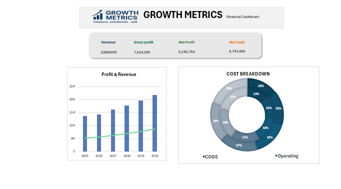
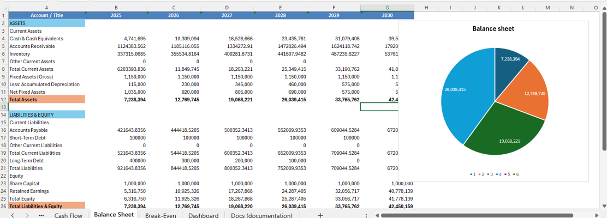

# SmartFinanceModel_BD.xlsx

A streamlined, Excel-based financial modeling tool designed for business analysts, founders, and finance teams. Built for clarity, speed, and control—no extra tables, no clutter. Just smart structure.

## 🔧 Features
- Named range–driven architecture for dynamic updates
- Shortcut ladder logic for rapid scenario testing
- Dashboard with linked charts and growth metrics
- Break-even analysis with margin of safety tracking
- Full financial statements: P&L, Cash Flow, Balance Sheet
- Input-driven forecasting with minimal manual edits

## 📂 Sheet Overview
| Sheet Name     | Purpose |
|----------------|---------|
| `Inputs`       | Core assumptions and drivers |
| `Revenue`      | Unit-based sales forecast |
| `Costs`        | Fixed and variable cost breakdown |
| `P&L`          | Profit & Loss statement |
| `Cash Flow`    | Operating, investing, financing flows |
| `Balance Sheet`| Assets, liabilities, equity |
| `Break-Even`   | Contribution margin, risk buffer |
| `Dashboard`    | Visual summary of key metrics |

## 📸 Screenshots
### Dashboard Overview  

### Balance Sheet Summary  

## 🧠 How to Use
1. Open the `Inputs` sheet and update your assumptions.
2. All calculations update automatically via named ranges.
3. Navigate to `Dashboard` for visual insights.
4. Use `Break-Even` to assess risk and sales thresholds.
5. Validate totals in `Balance Sheet` for consistency.

## 📎 Notes
- Currency: BDT  
- Timeframe: 2025–2030  
- No macros, no external plugins required  
- Designed for Excel 2016 and above

## 👤 Author
**Md Abdul Mannan**  
Financial Business Analyst | Excel Modeling Specialist  
GitHub: [https://github.com/mannan613](https://github.com/mannan613)